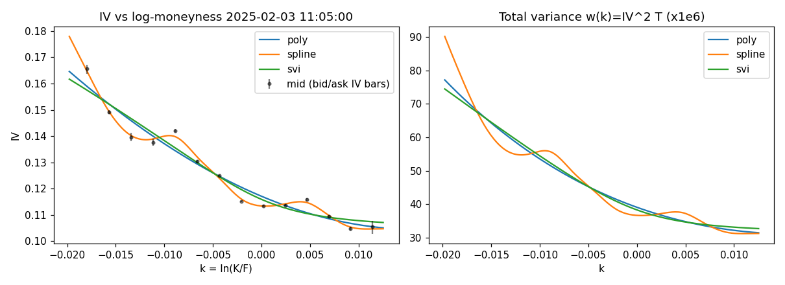
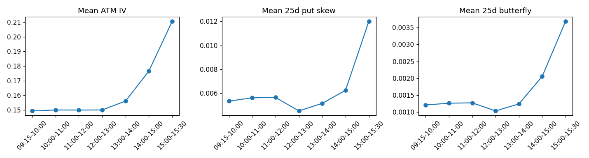
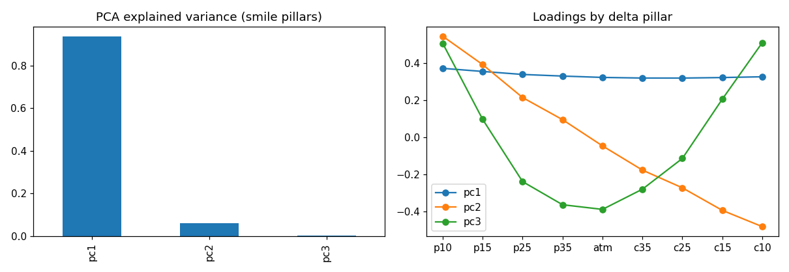
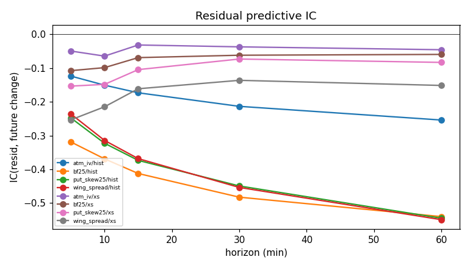
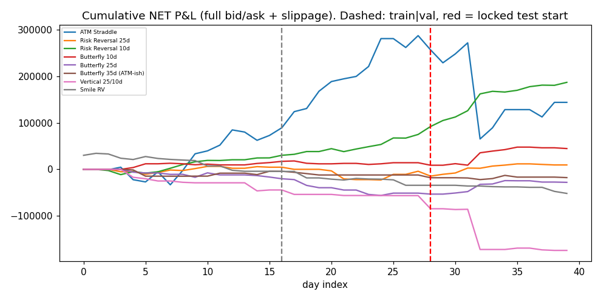
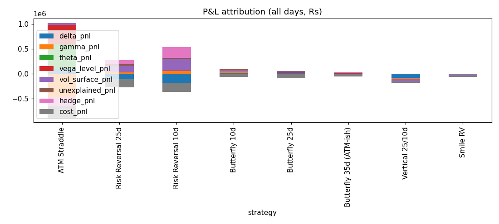

# NIFTY 50 0DTE Volatility Smile: Research Report

**Dataset:** SYNTHETIC (40 days, 5-min, planted mispricing=0.0)  
**Days:** 40  |  **Snapshots:** 3040  |  **Primary smile model:** `poly`  |  **Time convention:** `trading248`

> **WARNING - synthetic data.** This run validates the pipeline only. Nothing below is evidence about the real NIFTY market. The generator's latent factors mean-revert by construction, quotes carry independent noise, and the spot path has no variance risk premium. Re-run on real option-chain data for research conclusions.

## Periods (chronological, locked test never used for any choice)

| index | days | first | last |
|---|---|---|---|
| train | 16 | 2025-01-06 00:00:00 | 2025-01-27 00:00:00 |
| val | 12 | 2025-01-28 00:00:00 | 2025-02-12 00:00:00 |
| test | 12 | 2025-02-13 00:00:00 | 2025-02-28 00:00:00 |

## Final decision

**NO RELIABLE TRADING EDGE FOUND.** No structure satisfied all of: FDR-significant predictability, positive out-of-sample net P&L after realistic costs, parameter/strike/time/cost robustness, and edge larger than model uncertainty.

| strategy | grade | why |
|---|---|---|
| ATM Straddle | E | profitable in-sample (train+val) but fails out-of-sample and/or robustness |
| Risk Reversal 25d | B | FDR-significant predictive relationship, but: robustness 0.29 < 0.6; edge <= model uncertainty; only 17 OOS trades (< 30) |
| Risk Reversal 10d | B | FDR-significant predictive relationship, but: edge <= model uncertainty |
| Butterfly 10d | B | FDR-significant predictive relationship, but: edge <= model uncertainty; only 17 OOS trades (< 30) |
| Butterfly 25d | B | FDR-significant predictive relationship, but: robustness 0.34 < 0.6; edge <= model uncertainty; only 19 OOS trades (< 30) |
| Butterfly 35d (ATM-ish) | B | FDR-significant predictive relationship, but: OOS net P&L <= 0; OOS net Sharpe <= 1; robustness 0.00 < 0.6; edge <= model uncertainty; only 10 OOS trades (< 30) |
| Vertical 25/10d | B | FDR-significant predictive relationship, but: OOS net P&L <= 0; OOS net Sharpe <= 1; robustness 0.00 < 0.6; edge <= model uncertainty; only 13 OOS trades (< 30) |
| Smile RV | B | FDR-significant predictive relationship, but: OOS net P&L <= 0; OOS net Sharpe <= 1; robustness 0.00 < 0.6; edge <= model uncertainty; only 13 OOS trades (< 30) |

Grades: A strong candidate | B interesting research signal | C weak signal | D no evidence | E false discovery.

## Strategy leaderboard (config chosen on train+validation only; metrics on locked test)

| strategy | gross_sharpe_test | net_sharpe_test | sharpe_ci_test | max_dd_test | win_rate_test | trades_test | net_sharpe_all | robustness_oos | robustness_is | edge | model_uncertainty | grade |
|---|---|---|---|---|---|---|---|---|---|---|---|---|
| Risk Reversal 10d | 20.4 | 14.6 | [10.5, 29.4] | 1.55e+03 | 0.767 | 30 | 10 | 0.65 | 0.469 | 3.73e+03 | 4.86e+03 | B |
| Butterfly 10d | 7.71 | 4.88 | [-4.8, 10.8] | 3.22e+03 | 0.412 | 17 | 3.63 | 0.631 | 0.406 | 1.79e+03 | 4.29e+03 | B |
| Risk Reversal 25d | 19 | 3.6 | [-4.9, 16.2] | 2.32e+03 | 0.588 | 17 | 0.744 | 0.294 | 0 | 793 | 7.66e+03 | B |
| Butterfly 25d | 12 | 6.03 | [-2.9, 12.0] | 3.73e+03 | 0.421 | 19 | -2.34 | 0.344 | 0 | 1.22e+03 | 4.36e+03 | B |
| Butterfly 35d (ATM-ish) | 7.74 | -2.33 | [-13.8, 6.0] | 4.78e+03 | 0.4 | 10 | -2.16 | 0 | 0 | -563 | 3.84e+03 | B |
| ATM Straddle | -1.15 | -2.88 | [-8.5, 12.6] | 206,290 | 0.5 | 26 | 1.42 | 0 | 0.564 | -5.51e+03 | 2.56e+04 | E |
| Smile RV | -6.83 | -8.78 | [-15.6, -6.1] | 1.74e+04 | 0.231 | 13 | -3.08 | 0 | 0 | -1.34e+03 | 1.08e+03 | B |
| Vertical 25/10d | -5.6 | -6.07 | [-11.2, -0.3] | 8.94e+04 | 0.385 | 13 | -4.71 | 0 | 0 | -9.05e+03 | 1.3e+04 | B |

Ranking is by a composite (30% OOS net Sharpe, 20% walk-forward fold consistency, 20% OOS robustness, 10% low drawdown, 10% low turnover, 10% edge), not by Sharpe alone. 'gross' = mid prices, zero fees; 'net' = full bid/ask + slippage + statutory costs.

### Net P&L by period for the locked configs

| strategy | config | period | n_trades | total_gross | total_net | net_sharpe | max_dd | win_rate | profit_factor |
|---|---|---|---|---|---|---|---|---|---|
| ATM Straddle | thr=1.5|hedge=threshold:300 | train | 29 | 150,409 | 7.28e+04 | 3.7 | 3.77e+04 | 0.517 | 1.45 |
| ATM Straddle | thr=1.5|hedge=threshold:300 | val | 23 | 275,839 | 214,214 | 13.7 | 1.9e+04 | 0.783 | 5.43 |
| ATM Straddle | thr=1.5|hedge=threshold:300 | test | 26 | -5.24e+04 | -143,231 | -2.88 | 206,290 | 0.5 | 0.599 |
| Risk Reversal 25d | thr=2|hedge=ww:1 | train | 16 | 6.81e+04 | 4.61e+03 | 1.32 | 1.05e+04 | 0.5 | 1.19 |
| Risk Reversal 25d | thr=2|hedge=ww:1 | val | 8 | 2.25e+04 | -8.62e+03 | -1.65 | 2.74e+04 | 0.375 | 0.691 |
| Risk Reversal 25d | thr=2|hedge=ww:1 | test | 17 | 8.19e+04 | 1.35e+04 | 3.6 | 2.32e+03 | 0.588 | 1.65 |
| Risk Reversal 10d | thr=1.5|hedge=interval:5 | train | 28 | 8.59e+04 | 2.46e+04 | 5.57 | 1.13e+04 | 0.679 | 2.07 |
| Risk Reversal 10d | thr=1.5|hedge=interval:5 | val | 24 | 100,856 | 5.03e+04 | 13.2 | 6.35e+03 | 0.75 | 3.56 |
| Risk Reversal 10d | thr=1.5|hedge=interval:5 | test | 30 | 180,149 | 111,817 | 14.6 | 1.55e+03 | 0.767 | 11.9 |
| Butterfly 10d | thr=2|hedge=threshold:300 | train | 14 | 3.15e+04 | 1.45e+04 | 5.79 | 3.53e+03 | 0.643 | 2.82 |
| Butterfly 10d | thr=2|hedge=threshold:300 | val | 13 | 1.56e+04 | -260 | -0.163 | 7.54e+03 | 0.538 | 0.98 |
| Butterfly 10d | thr=2|hedge=threshold:300 | test | 17 | 5.26e+04 | 3.04e+04 | 4.88 | 3.22e+03 | 0.412 | 2.6 |
| Butterfly 25d | thr=2|hedge=threshold:300 | train | 14 | 7.86e+03 | -1.65e+04 | -4.51 | 1.7e+04 | 0.286 | 0.436 |
| Butterfly 25d | thr=2|hedge=threshold:300 | val | 13 | -1.12e+04 | -3.45e+04 | -9.68 | 3.58e+04 | 0.308 | 0.237 |
| Butterfly 25d | thr=2|hedge=threshold:300 | test | 19 | 6.08e+04 | 2.31e+04 | 6.03 | 3.73e+03 | 0.421 | 1.64 |
| Butterfly 35d (ATM-ish) | thr=2.5|hedge=threshold:300 | train | 7 | 1.12e+04 | -4.15e+03 | -0.945 | 1.47e+04 | 0.429 | 0.767 |
| Butterfly 35d (ATM-ish) | thr=2.5|hedge=threshold:300 | val | 3 | -2.17e+03 | -7.93e+03 | -8.6 | 7.93e+03 | 0 | 0 |
| Butterfly 35d (ATM-ish) | thr=2.5|hedge=threshold:300 | test | 10 | 1.87e+04 | -5.63e+03 | -2.33 | 4.78e+03 | 0.4 | 0.724 |
| Vertical 25/10d | thr=2.5|hedge=threshold:300 | train | 9 | -3.61e+04 | -4.42e+04 | -7.45 | 4.62e+04 | 0.222 | 0.0422 |
| Vertical 25/10d | thr=2.5|hedge=threshold:300 | val | 5 | -6.82e+03 | -1.21e+04 | -5.74 | 1.21e+04 | 0.2 | 0.256 |
| Vertical 25/10d | thr=2.5|hedge=threshold:300 | test | 13 | -103,810 | -117,592 | -6.07 | 8.94e+04 | 0.385 | 0.0884 |
| Smile RV | thr=2.5|hedge=threshold:300 | train | 26 | 1.03e+04 | -4.1e+03 | -0.432 | 3.85e+04 | 0.346 | 0.921 |
| Smile RV | thr=2.5|hedge=threshold:300 | val | 20 | -1.88e+04 | -3.01e+04 | -7.81 | 2.97e+04 | 0.2 | 0.167 |
| Smile RV | thr=2.5|hedge=threshold:300 | test | 13 | -9.98e+03 | -1.74e+04 | -8.78 | 1.74e+04 | 0.231 | 0.2 |

### Cost scenarios (locked test period)

| strategy | scenario | gross_pnl_test | net_pnl_test | net_sharpe_test | net_pnl_all | net_sharpe_all | trades_all |
|---|---|---|---|---|---|---|---|
| ATM Straddle | mid | -5.24e+04 | -108,972 | -2.25 | 235,081 | 2.37 | 78 |
| ATM Straddle | half | -5.24e+04 | -119,472 | -2.45 | 206,815 | 2.07 | 78 |
| ATM Straddle | full | -5.24e+04 | -129,972 | -2.64 | 178,548 | 1.77 | 78 |
| ATM Straddle | full_slip | -5.24e+04 | -143,231 | -2.88 | 143,762 | 1.42 | 78 |
| Risk Reversal 25d | mid | 8.19e+04 | 2.83e+04 | 7.64 | 4.34e+04 | 3.42 | 41 |
| Risk Reversal 25d | half | 8.19e+04 | 2.32e+04 | 6.29 | 3.15e+04 | 2.49 | 41 |
| Risk Reversal 25d | full | 8.19e+04 | 1.82e+04 | 4.91 | 1.96e+04 | 1.55 | 41 |
| Risk Reversal 25d | full_slip | 8.19e+04 | 1.35e+04 | 3.6 | 9.47e+03 | 0.744 | 41 |
| Risk Reversal 10d | mid | 180,149 | 130,761 | 16.4 | 237,377 | 12.3 | 82 |
| Risk Reversal 10d | half | 180,149 | 124,015 | 15.8 | 219,356 | 11.5 | 82 |
| Risk Reversal 10d | full | 180,149 | 117,269 | 15.1 | 201,335 | 10.7 | 82 |
| Risk Reversal 10d | full_slip | 180,149 | 111,817 | 14.6 | 186,731 | 10 | 82 |
| Butterfly 10d | mid | 5.26e+04 | 4.74e+04 | 7.12 | 8.69e+04 | 6.47 | 44 |
| Butterfly 10d | half | 5.26e+04 | 4.18e+04 | 6.42 | 7.29e+04 | 5.59 | 44 |
| Butterfly 10d | full | 5.26e+04 | 3.63e+04 | 5.67 | 5.89e+04 | 4.64 | 44 |
| Butterfly 10d | full_slip | 5.26e+04 | 3.04e+04 | 4.88 | 4.46e+04 | 3.63 | 44 |
| Butterfly 25d | mid | 6.08e+04 | 5.27e+04 | 11 | 3.88e+04 | 2.88 | 46 |
| Butterfly 25d | half | 6.08e+04 | 4.31e+04 | 9.67 | 1.71e+04 | 1.33 | 46 |
| Butterfly 25d | full | 6.08e+04 | 3.36e+04 | 8.08 | -4.56e+03 | -0.368 | 46 |
| Butterfly 25d | full_slip | 6.08e+04 | 2.31e+04 | 6.03 | -2.79e+04 | -2.34 | 46 |
| Butterfly 35d (ATM-ish) | mid | 1.87e+04 | 1.37e+04 | 6 | 1.83e+04 | 2.31 | 20 |
| Butterfly 35d (ATM-ish) | half | 1.87e+04 | 7.61e+03 | 3.43 | 6.87e+03 | 0.875 | 20 |
| Butterfly 35d (ATM-ish) | full | 1.87e+04 | 1.5e+03 | 0.67 | -4.57e+03 | -0.577 | 20 |
| Butterfly 35d (ATM-ish) | full_slip | 1.87e+04 | -5.63e+03 | -2.33 | -1.77e+04 | -2.16 | 20 |
| Vertical 25/10d | mid | -103,810 | -106,115 | -5.69 | -151,190 | -4.28 | 27 |
| Vertical 25/10d | half | -103,810 | -110,099 | -5.83 | -159,116 | -4.44 | 27 |
| Vertical 25/10d | full | -103,810 | -114,084 | -5.96 | -167,042 | -4.59 | 27 |
| Vertical 25/10d | full_slip | -103,810 | -117,592 | -6.07 | -173,941 | -4.71 | 27 |
| Smile RV | mid | -9.98e+03 | -1.16e+04 | -7.39 | -2.59e+04 | -1.56 | 59 |
| Smile RV | half | -9.98e+03 | -1.37e+04 | -7.98 | -3.48e+04 | -2.08 | 59 |
| Smile RV | full | -9.98e+03 | -1.57e+04 | -8.45 | -4.36e+04 | -2.61 | 59 |
| Smile RV | full_slip | -9.98e+03 | -1.74e+04 | -8.78 | -5.16e+04 | -3.08 | 59 |

### Walk-forward folds (config re-selected using only earlier days)

| strategy | fold | first | last | config | n_trades | net_pnl | net_sharpe |
|---|---|---|---|---|---|---|---|
| ATM Straddle | 1 | 2025-01-28 00:00:00 | 2025-02-06 00:00:00 | thr=2|hedge=threshold:300 | 5 | 3.45e+04 | 9.95 |
| ATM Straddle | 2 | 2025-02-07 00:00:00 | 2025-02-18 00:00:00 | thr=1.5|hedge=threshold:300 | 17 | 5.08e+04 | 3.18 |
| ATM Straddle | 3 | 2025-02-19 00:00:00 | 2025-02-28 00:00:00 | thr=1.5|hedge=threshold:300 | 14 | -127,746 | -3.18 |
| Risk Reversal 25d | 1 | 2025-01-28 00:00:00 | 2025-02-06 00:00:00 | thr=2|hedge=interval:5 | 5 | -2.88e+04 | -8.53 |
| Risk Reversal 25d | 2 | 2025-02-07 00:00:00 | 2025-02-18 00:00:00 | thr=2|hedge=ww:1 | 10 | 2.48e+04 | 6.81 |
| Risk Reversal 25d | 3 | 2025-02-19 00:00:00 | 2025-02-28 00:00:00 | thr=2|hedge=ww:1 | 10 | 6.68e+03 | 6.3 |
| Risk Reversal 10d | 1 | 2025-01-28 00:00:00 | 2025-02-06 00:00:00 | thr=2|hedge=threshold:300 | 5 | -3.21e+03 | -0.964 |
| Risk Reversal 10d | 2 | 2025-02-07 00:00:00 | 2025-02-18 00:00:00 | thr=1.5|hedge=interval:5 | 22 | 7.72e+04 | 26.6 |
| Risk Reversal 10d | 3 | 2025-02-19 00:00:00 | 2025-02-28 00:00:00 | thr=1.5|hedge=interval:5 | 17 | 6.08e+04 | 10 |
| Butterfly 10d | 1 | 2025-01-28 00:00:00 | 2025-02-06 00:00:00 | thr=2|hedge=threshold:300 | 10 | -3.98e+03 | -3.34 |
| Butterfly 10d | 2 | 2025-02-07 00:00:00 | 2025-02-18 00:00:00 | thr=2|hedge=threshold:300 | 10 | -1.54e+03 | -1.06 |
| Butterfly 10d | 3 | 2025-02-19 00:00:00 | 2025-02-28 00:00:00 | thr=2.5|hedge=threshold:300 | 6 | 3.44e+04 | 5.12 |
| Butterfly 25d | 1 | 2025-01-28 00:00:00 | 2025-02-06 00:00:00 | thr=1.5|hedge=threshold:300 | 17 | -4.2e+04 | -22 |
| Butterfly 25d | 2 | 2025-02-07 00:00:00 | 2025-02-18 00:00:00 | thr=1.5|hedge=threshold:300 | 25 | -2.76e+04 | -6.99 |
| Butterfly 25d | 3 | 2025-02-19 00:00:00 | 2025-02-28 00:00:00 | thr=2.5|hedge=interval:15 | 7 | -4.2e+03 | -3.45 |
| Butterfly 35d (ATM-ish) | 1 | 2025-01-28 00:00:00 | 2025-02-06 00:00:00 | thr=2|hedge=interval:15 | 11 | -1.73e+04 | -8.21 |
| Butterfly 35d (ATM-ish) | 2 | 2025-02-07 00:00:00 | 2025-02-18 00:00:00 | thr=2.5|hedge=threshold:300 | 3 | -6.42e+03 | -6.11 |
| Butterfly 35d (ATM-ish) | 3 | 2025-02-19 00:00:00 | 2025-02-28 00:00:00 | thr=2.5|hedge=threshold:300 | 7 | 787 | 0.464 |
| Vertical 25/10d | 1 | 2025-01-28 00:00:00 | 2025-02-06 00:00:00 | thr=2|hedge=interval:15 | 12 | -1.96e+04 | -20.1 |
| Vertical 25/10d | 2 | 2025-02-07 00:00:00 | 2025-02-18 00:00:00 | thr=2.5|hedge=threshold:300 | 7 | -2.96e+04 | -5.87 |
| Vertical 25/10d | 3 | 2025-02-19 00:00:00 | 2025-02-28 00:00:00 | thr=2.5|hedge=threshold:300 | 7 | -8.82e+04 | -5.7 |
| Smile RV | 1 | 2025-01-28 00:00:00 | 2025-02-06 00:00:00 | thr=2.5|hedge=threshold:300 | 13 | -1.66e+04 | -6.39 |
| Smile RV | 2 | 2025-02-07 00:00:00 | 2025-02-18 00:00:00 | thr=2.5|hedge=threshold:300 | 8 | -1.5e+04 | -7.38 |
| Smile RV | 3 | 2025-02-19 00:00:00 | 2025-02-28 00:00:00 | thr=2.5|hedge=threshold:300 | 12 | -1.59e+04 | -10.2 |

### P&L attribution (Rs)

| strategy | period | delta_pnl | gamma_pnl | theta_pnl | vega_level_pnl | vol_surface_pnl | unexplained_pnl | hedge_pnl | cost_pnl | net_pnl |
|---|---|---|---|---|---|---|---|---|---|---|
| ATM Straddle | test | 140,376 | -344,434 | 309,253 | 5e+04 | 4e+04 | -2e+03 | -242,789 | -9e+04 | -143,231 |
| ATM Straddle | all | 107,603 | -456,642 | 483,201 | 397,133 | 3e+04 | -2e+04 | -171,292 | -230,084 | 143,762 |
| Risk Reversal 25d | test | -114,008 | 1e+04 | 2e+03 | -2e+03 | 6e+04 | 6e+03 | 111,775 | -7e+04 | 1e+04 |
| Risk Reversal 25d | all | -1e+05 | 3e+04 | 3e+02 | -1e+04 | 134,948 | 2e+04 | 9e+04 | -163,042 | 9e+03 |
| Risk Reversal 10d | test | -7e+04 | 4e+04 | -1e+04 | 1e+04 | 109,838 | 6e+03 | 1e+05 | -7e+04 | 111,817 |
| Risk Reversal 10d | all | -176,013 | 6e+04 | 5e+03 | 3e+03 | 225,924 | 3e+04 | 218,245 | -180,172 | 186,731 |
| Butterfly 10d | test | 2e+04 | 1e+04 | 4e+03 | 1e+03 | -4e+03 | 2e+04 | 0 | -2e+04 | 3e+04 |
| Butterfly 10d | all | 1e+04 | 3e+04 | -8e+03 | 4e+03 | 3e+04 | 2e+04 | 0 | -5e+04 | 4e+04 |
| Butterfly 25d | test | 3e+04 | 2e+03 | 8e+03 | 4e+02 | 3e+03 | 1e+04 | 0 | -4e+04 | 2e+04 |
| Butterfly 25d | all | 1e+04 | 1e+04 | 8e+02 | 4e+03 | 2e+04 | 9e+03 | 0 | -9e+04 | -3e+04 |
| Butterfly 35d (ATM-ish) | test | 8e+03 | 4e+03 | -1e+02 | 1e+03 | 5e+03 | 4e+02 | 0 | -2e+04 | -6e+03 |
| Butterfly 35d (ATM-ish) | all | 2e+03 | 6e+03 | -3e+03 | 3e+03 | 2e+04 | 2e+03 | 0 | -5e+04 | -2e+04 |
| Vertical 25/10d | test | -5e+04 | -1e+04 | -2e+03 | -1e+03 | -3e+04 | -3e+03 | 0 | -1e+04 | -117,592 |
| Vertical 25/10d | all | -8e+04 | -2e+04 | -6e+02 | -3e+03 | -4e+04 | 7e+02 | 0 | -3e+04 | -173,941 |
| Smile RV | test | -7e+03 | -4e+02 | 3e+02 | 4e+02 | -1e+03 | -2e+03 | 0 | -7e+03 | -2e+04 |
| Smile RV | all | -9e+03 | 8e+02 | 4e+03 | 3e+03 | -1e+03 | -2e+04 | 0 | -3e+04 | -5e+04 |

`vega_level_pnl` = net vega x change in ATM IV; `vol_surface_pnl` = leg-level vega x (leg IV change - ATM IV change), i.e. the smile-shape component the strategies intend to harvest; `unexplained_pnl` is the discretisation residual.

## Answers to the research questions

### Q1. Can the 0DTE smile be modelled reliably?

| model | fit_rmse | cv_rmse | wing_extrap_rmse | arb_violation_rate | butterfly_violation_rate | total_var_rel_rmse | atm_step_abs | skew25_step_abs |
|---|---|---|---|---|---|---|---|---|
| poly | 0.003425 | 0.004356 | 0.00525 | 0.2 | 0 | 0.03916 | 0.004455 | 0.002416 |
| spline | 0.002511 | 0.004714 | 0.00653 | 0.1167 | 0.06667 | 0.02811 | 0.004626 | 0.003274 |
| svi | 0.00363 | 0.00503 | 0.008591 | 0.2167 | 0.1667 | 0.04867 | 0.00519 | 0.002817 |

Best hold-out model: `poly` (cv RMSE 0.0044 IV units vs typical quoted IV half-spread 0.0026). Fit is outside the quote noise band. 72% of snapshots give an arbitrage-free fit with the primary model. SVI is not assumed best; choice is by hold-out error.

Time-convention sensitivity (level shift only, exact under Black-76):

| convention | mean_atm_iv | vs_trading248 |
|---|---|---|
| trading248 | 0.1573 | 1 |
| trading252 | 0.156 | 0.992 |
| calendar | 0.06616 | 0.4206 |

### Q2. Dominant smile factors

| index | explained_var | label |
|---|---|---|
| pc1 | 0.936 | level |
| pc2 | 0.0606 | skew/slope |
| pc3 | 0.00365 | curvature |

First three PCs explain 100.0% of cross-sectional smile variance. Factor statistics:

| index | label | ac1 | corr_spot_ret | corr_rv | corr_vix | corr_tau |
|---|---|---|---|---|---|---|
| pc1 | level | 0.885 | 0.00673 | 0.493 | 0.501 | -0.356 |
| pc2 | skew/slope | 0.763 | -0.00176 | -0.0171 | -0.0121 | 0.00767 |
| pc3 | curvature | 0.674 | -0.0619 | -0.0672 | -0.153 | -0.118 |
| atm_iv | raw | 0.88 | 0.0309 | 0.493 | 0.511 | -0.347 |
| put_skew25 | raw | 0.747 | -0.0147 | 0.0954 | 0.0815 | -0.091 |
| bf25 | raw | 0.68 | -0.0361 | 0.136 | 0.0663 | -0.232 |

### Q3. Are the factors predictable?  Q4. Do residuals mean-revert?

166 of 170 (fair model, factor, horizon) tests show FDR-significant (BH, q=5%) mean-reverting predictive power (negative IC and negative beta of the future smile change on the residual).

| fair | factor | h_min | ic | ic_lo | ic_hi | p_adj_bh | beta_dchange | phi | half_life_min | adf_t |
|---|---|---|---|---|---|---|---|---|---|---|
| hist | call_skew25 | 60 | -0.55 | -0.598 | -0.501 | 0 | -0.75 | 0.85 | 21.3 | -13.2 |
| hist | wing_spread | 60 | -0.549 | -0.598 | -0.502 | 0 | -0.732 | 0.849 | 21.2 | -13.1 |
| hist | rr25 | 60 | -0.549 | -0.598 | -0.502 | 0 | -0.732 | 0.849 | 21.2 | -13.1 |
| hist | put_skew25 | 60 | -0.545 | -0.595 | -0.488 | 0 | -0.713 | 0.843 | 20.2 | -13.4 |
| gbm | put_skew25 | 60 | -0.543 | -0.61 | -0.479 | 0 | -0.684 | 0.86 | 22.9 | -12 |
| hist | curv | 60 | -0.541 | -0.603 | -0.484 | 0 | -0.687 | 0.782 | 14.1 | -17.2 |
| hist | bf25 | 60 | -0.54 | -0.596 | -0.486 | 0 | -0.68 | 0.779 | 13.9 | -17.1 |
| ridge | rr25 | 60 | -0.54 | -0.603 | -0.475 | 0 | -0.709 | 0.858 | 22.6 | -11.9 |
| ridge | wing_spread | 60 | -0.54 | -0.603 | -0.475 | 0 | -0.709 | 0.858 | 22.6 | -11.9 |
| ridge | put_skew25 | 60 | -0.54 | -0.603 | -0.473 | 0 | -0.696 | 0.85 | 21.4 | -12.3 |
| ridge | call_skew25 | 60 | -0.54 | -0.596 | -0.473 | 0 | -0.717 | 0.86 | 23 | -12 |
| gbm | bf25 | 60 | -0.531 | -0.593 | -0.475 | 0 | -0.656 | 0.8 | 15.6 | -15.6 |

Caution: part of any measured reversion is quote noise / bid-ask bounce in the fitted smile, which is not capturable at executable prices. The backtest, not the IC, decides tradability.

### Q5. Half-life of mispricing (median over factors, minutes)

| fair | half_life_min |
|---|---|
| gbm | 23.4 |
| hist | 20.7 |
| pca_trailing_mean | 14 |
| ridge | 22 |
| xs | 4.46 |

Average across fair models: **16.9 min** (resolution is limited by the snapshot interval).

### Q6. Which part of the smile carries the strongest signal?

| factor | min_ic | n_fdr | best_p_adj |
|---|---|---|---|
| call_skew25 | -0.55 | 20 | 0 |
| rr25 | -0.549 | 20 | 0 |
| wing_spread | -0.549 | 20 | 0 |
| put_skew25 | -0.545 | 20 | 0 |
| curv | -0.541 | 15 | 0 |
| bf25 | -0.54 | 20 | 0 |
| pc2 | -0.41 | 5 | 0 |
| pc3 | -0.391 | 5 | 0 |
| bf10 | -0.358 | 20 | 0 |
| pc1 | -0.296 | 5 | 0 |
| atm_iv | -0.29 | 18 | 1.45e-08 |

Strongest FDR-significant reversion signal: **call_skew25** (fair model `hist`, h=60 min, IC=-0.550).

### Q7. Which structure best isolates the signal?

Top composite rank: **Risk Reversal 10d** (thr=1.5|hedge=interval:5); grade B. Net test P&L Rs 111,817. The per-strategy statement of what each structure is betting on:

- **ATM Straddle**: Short (long) ATM volatility when ATM IV is rich (cheap) vs fair; delta-hedged, so it is a bet on realised-vs-implied variance over the holding period plus the IV reversion (net vega and gamma/theta).
- **Risk Reversal**: Delta-hedged, vega-neutral 25-delta risk reversal: sells the rich put wing and buys the call wing (or the reverse). Net bet is on the SKEW (IV25P-IV25C) mean-reverting, not on direction or level.
- **Butterfly**: Vega-neutral, delta-hedged long/short wings vs ATM straddle. Net bet is on smile CURVATURE (butterfly IV) reverting; it still carries gamma/theta mismatch between wings and body.
- **Vertical**: Delta-hedged, vega-neutral put (or call) vertical: bets that the 25d wing IV is rich/cheap relative to the 10d wing, i.e. on the wing's SLOPE rather than level or direction.
- **Smile RV**: Isolates pillar-vs-neighbour smile dislocation: short the pillar whose IV is richest relative to what its neighbours imply, long the cheapest, vega-neutral and delta-hedged. Exposure is to the dislocation closing, not to the smile level or spot.

### Q8. Profitable after realistic costs?

Net P&L (all days, Rs) by execution scenario:

| strategy | mid | half | full | full_slip |
|---|---|---|---|---|
| ATM Straddle | 235,081 | 206,815 | 178,548 | 143,762 |
| Butterfly 10d | 9e+04 | 7e+04 | 6e+04 | 4e+04 |
| Butterfly 25d | 4e+04 | 2e+04 | -5e+03 | -3e+04 |
| Butterfly 35d (ATM-ish) | 2e+04 | 7e+03 | -5e+03 | -2e+04 |
| Risk Reversal 10d | 237,377 | 219,356 | 201,335 | 186,731 |
| Risk Reversal 25d | 4e+04 | 3e+04 | 2e+04 | 9e+03 |
| Smile RV | -3e+04 | -3e+04 | -4e+04 | -5e+04 |
| Vertical 25/10d | -151,190 | -159,116 | -167,042 | -173,941 |

4 of 8 structures are net-positive over all days at full bid/ask + slippage; see OOS below.

### Q9. Profitable out-of-sample?

| strategy | train | val | test |
|---|---|---|---|
| ATM Straddle | 7e+04 | 214,214 | -143,231 |
| Butterfly 10d | 1e+04 | -3e+02 | 3e+04 |
| Butterfly 25d | -2e+04 | -3e+04 | 2e+04 |
| Butterfly 35d (ATM-ish) | -4e+03 | -8e+03 | -6e+03 |
| Risk Reversal 10d | 2e+04 | 5e+04 | 111,817 |
| Risk Reversal 25d | 5e+03 | -9e+03 | 1e+04 |
| Smile RV | -4e+03 | -3e+04 | -2e+04 |
| Vertical 25/10d | -4e+04 | -1e+04 | -117,592 |

### Q10. Survival under perturbations

Per-strategy perturbation tables (entry threshold 1.5-2.5, strike delta +-0.05, entry-time windows, hedge rule, 2x fees, 2x/4x slippage) are in `tables/robustness__*.csv`; robustness score = half sign-retention, half gradual degradation:

| strategy | robustness_oos | robustness_is | edge | model_uncertainty | edge_gt_uncertainty |
|---|---|---|---|---|---|
| ATM Straddle | 0 | 0.564 | -5.51e+03 | 2.56e+04 | False |
| Risk Reversal 25d | 0.294 | 0 | 793 | 7.66e+03 | False |
| Risk Reversal 10d | 0.65 | 0.469 | 3.73e+03 | 4.86e+03 | False |
| Butterfly 10d | 0.631 | 0.406 | 1.79e+03 | 4.29e+03 | False |
| Butterfly 25d | 0.344 | 0 | 1.22e+03 | 4.36e+03 | False |
| Butterfly 35d (ATM-ish) | 0 | 0 | -563 | 3.84e+03 | False |
| Vertical 25/10d | 0 | 0 | -9.05e+03 | 1.3e+04 | False |
| Smile RV | 0 | 0 | -1.34e+03 | 1.08e+03 | False |

Regime splits of OOS P&L (low/high VIX, rising/falling VIX, gap, realised vol, trend, dealer gamma sign) are in `tables/regimes_test__*.csv`; a strategy earning everything in one regime is not robust.

## Hypothesis signals and fair-smile models

Fair model chosen per hypothesis on train+val only (most negative IC of residual vs next-15-minute smile change):

| index | fair_model | sel_IC |
|---|---|---|
| H1_atm | hist | -0.245 |
| H2_skew | hist | -0.382 |
| H2c_skew | hist | -0.378 |
| H3_wing | hist | -0.377 |
| H4_curv | gbm | -0.444 |

Fair-model out-of-sample RMSE by factor (IV units):

| factor | gbm | hist | ridge | xs |
|---|---|---|---|---|
| atm_iv | 0.02382 | 0.02391 | 0.02317 | 0.01542 |
| bf10 | 0.07575 | 0.07232 | 0.07476 | 0.06623 |
| bf25 | 0.00155 | 0.001456 | 0.001534 | 0.03833 |
| call_skew25 | 0.006847 | 0.006143 | 0.006394 | 0.0386 |
| curv | 0.006145 | 0.005823 | 0.006095 |  |
| put_skew25 | 0.007388 | 0.006879 | 0.007113 | 0.03819 |
| rr25 | 0.014 | 0.01271 | 0.01319 | 0.004309 |
| wing_spread | 0.01396 | 0.01271 | 0.01319 | 0.004309 |

`hist` = same-time-of-day mean of earlier days (ATM VIX-scaled); `xs` = neighbour-implied (held-out polynomial); `ridge` = dynamic factor regression on VIX/tau/gamma/returns/realised vol/slow factor; `gbm` = gradient boosting. ML is only preferred if it beats the ridge model out-of-sample by a clear margin (compare columns above).

## Data-quality and forward checks

| index | value |
|---|---|
| f_nonpositive | 104,032 |
| f_crossed | 0 |
| f_duplicate | 0 |
| f_stale | 0 |
| f_zero_liq | 8 |
| f_wide | 119,279 |
| rows | 370,880 |
| clean_rows | 251,598 |
| clean_frac | 0.6784 |

| index | rows |
|---|---|
| ok | 317214 |
| below_intrinsic | 53666 |

| pcp_minus_fut_mean | pcp_minus_fut_std | spot_minus_fut_mean | final_minus_fut_std | pcp_available_frac |
|---|---|---|---|---|
| -0.02125 | 0.8114 | -2.889 | 0.568 | 0.9941 |

## Expiry-day time buckets

| index | atm_iv | put_skew25 | bf25 | atm_xs_resid_std | bf25_xs_resid_std | skew_xs_resid_std |
|---|---|---|---|---|---|---|
| 09:15-10:00 | 0.1494 | 0.005331 | 0.001213 | 0.001103 | 0.001622 | 0.001882 |
| 10:00-11:00 | 0.1501 | 0.005608 | 0.001266 | 0.001164 | 0.001685 | 0.001987 |
| 11:00-12:00 | 0.15 | 0.005638 | 0.001277 | 0.001303 | 0.001907 | 0.002218 |
| 12:00-13:00 | 0.1501 | 0.00451 | 0.001038 | 0.001413 | 0.002078 | 0.002534 |
| 13:00-14:00 | 0.1561 | 0.005144 | 0.001244 | 0.001454 | 0.0021 | 0.002578 |
| 14:00-15:00 | 0.1766 | 0.006236 | 0.002058 | 0.001653 | 0.002334 | 0.00292 |
| 15:00-15:30 | 0.2105 | 0.01201 | 0.003682 | 0.0718 | 0.18 | 0.1796 |

## Plots

## Limitations
- Fills assume one lot-multiple order fills at the next snapshot's bid/ask when volume >= 20x size; no quote sizes / queue modelling.
- Statutory cost rates are configurable defaults in `backtest/costs.py`; verify before real use.
- Short windows (one week of real data) make every statistic weak; the framework reports uncertainty rather than hiding it.
- Regime tags use sample medians and are descriptive only.
