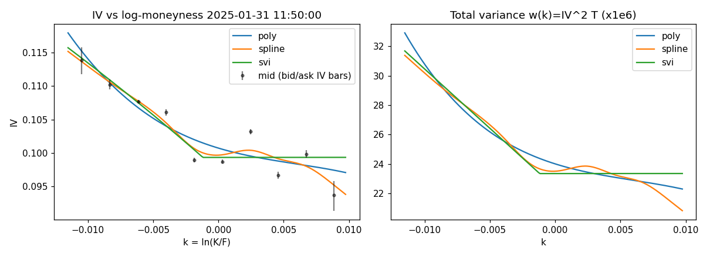
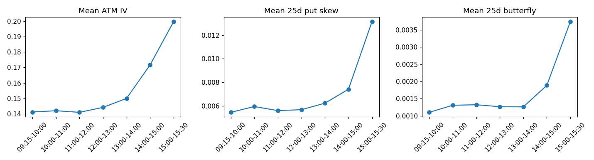
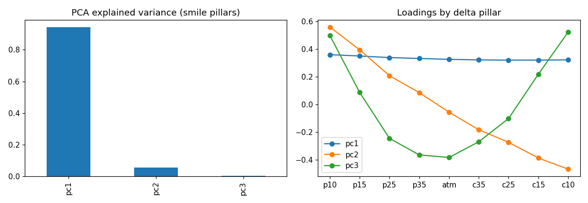
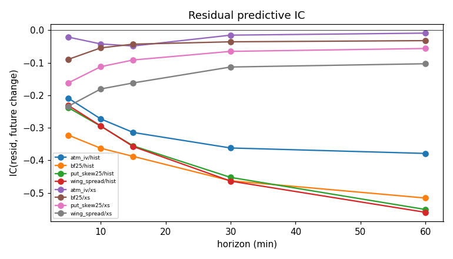
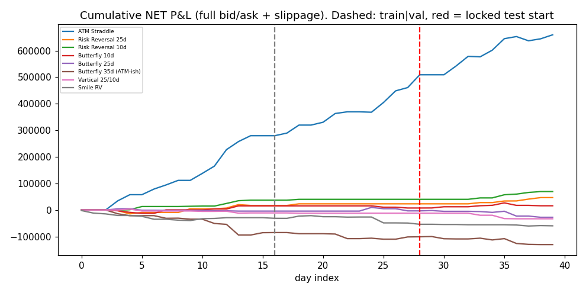
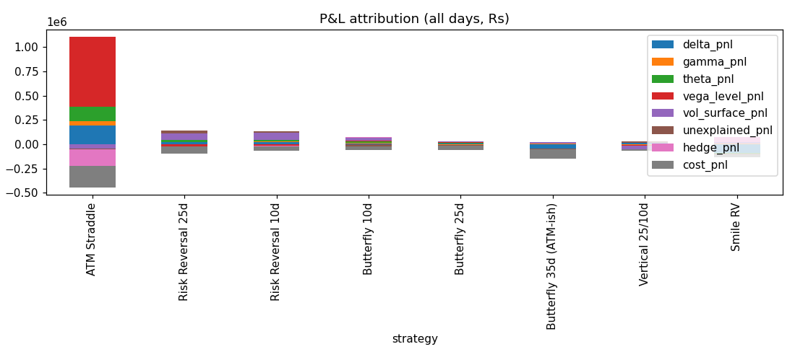

# NIFTY 50 0DTE Volatility Smile: Research Report

**Dataset:** SYNTHETIC (40 days, 5-min, planted mispricing=0.01)  
**Days:** 40  |  **Snapshots:** 3040  |  **Primary smile model:** `poly`  |  **Time convention:** `trading248`

> **WARNING - synthetic data.** This run validates the pipeline only. Nothing below is evidence about the real NIFTY market. The generator's latent factors mean-revert by construction, quotes carry independent noise, and the spot path has no variance risk premium. Re-run on real option-chain data for research conclusions.

## Periods (chronological, locked test never used for any choice)

| index | days | first | last |
|---|---|---|---|
| train | 16 | 2025-01-06 00:00:00 | 2025-01-27 00:00:00 |
| val | 12 | 2025-01-28 00:00:00 | 2025-02-12 00:00:00 |
| test | 12 | 2025-02-13 00:00:00 | 2025-02-28 00:00:00 |

## Final decision

**NO RELIABLE TRADING EDGE FOUND.** No structure satisfied all of: FDR-significant predictability, positive out-of-sample net P&L after realistic costs, parameter/strike/time/cost robustness, and edge larger than model uncertainty.

| strategy | grade | why |
|---|---|---|
| ATM Straddle | B | FDR-significant predictive relationship, but: robustness 0.55 < 0.6; edge <= model uncertainty; only 18 OOS trades (< 30) |
| Risk Reversal 25d | B | FDR-significant predictive relationship, but: robustness 0.47 < 0.6; edge <= model uncertainty; only 6 OOS trades (< 30) |
| Risk Reversal 10d | B | FDR-significant predictive relationship, but: edge <= model uncertainty; only 6 OOS trades (< 30) |
| Butterfly 10d | B | FDR-significant predictive relationship, but: robustness 0.41 < 0.6; edge <= model uncertainty; only 7 OOS trades (< 30) |
| Butterfly 25d | B | FDR-significant predictive relationship, but: OOS net P&L <= 0; OOS net Sharpe <= 1; robustness 0.00 < 0.6; edge <= model uncertainty; only 7 OOS trades (< 30) |
| Butterfly 35d (ATM-ish) | B | FDR-significant predictive relationship, but: OOS net P&L <= 0; OOS net Sharpe <= 1; robustness 0.00 < 0.6; edge <= model uncertainty; only 17 OOS trades (< 30) |
| Vertical 25/10d | B | FDR-significant predictive relationship, but: OOS net P&L <= 0; OOS net Sharpe <= 1; robustness 0.00 < 0.6; edge <= model uncertainty; only 4 OOS trades (< 30) |
| Smile RV | B | FDR-significant predictive relationship, but: OOS net P&L <= 0; OOS net Sharpe <= 1; robustness 0.00 < 0.6; edge <= model uncertainty; only 10 OOS trades (< 30) |

Grades: A strong candidate | B interesting research signal | C weak signal | D no evidence | E false discovery.

## Strategy leaderboard (config chosen on train+validation only; metrics on locked test)

| strategy | gross_sharpe_test | net_sharpe_test | sharpe_ci_test | max_dd_test | win_rate_test | trades_test | net_sharpe_all | robustness_oos | robustness_is | edge | model_uncertainty | grade |
|---|---|---|---|---|---|---|---|---|---|---|---|---|
| ATM Straddle | 14.9 | 12.8 | [5.4, 24.6] | 1.6e+04 | 0.778 | 18 | 14.8 | 0.545 | 0.545 | 1.1e+04 | 2.36e+04 | B |
| Risk Reversal 10d | 11.3 | 10.2 | [6.2, 16.7] | 0 | 1 | 6 | 7.83 | 0.658 | 0.62 | 4.86e+03 | 6.62e+03 | B |
| Risk Reversal 25d | 11.8 | 10.7 | [4.8, 17.8] | 0 | 1 | 6 | 4.38 | 0.469 | 0.406 | 3.91e+03 | 9.15e+03 | B |
| Butterfly 10d | 5.65 | 2.56 | [-5.9, 13.8] | 1.08e+04 | 0.714 | 7 | 1.56 | 0.406 | 0.219 | 1.21e+03 | 4.67e+03 | B |
| Smile RV | -4.7 | -7.93 | [-15.6, -0.4] | 6.5e+03 | 0.1 | 10 | -4.91 | 0 | 0 | -1.05e+03 | 830 | B |
| Butterfly 25d | -2.63 | -5.68 | [-12.8, 3.2] | 2.53e+04 | 0.286 | 7 | -2.53 | 0 | 0 | -3.45e+03 | 6.14e+03 | B |
| Vertical 25/10d | -6.23 | -6.79 | [-12.2, -4.5] | 2.09e+04 | 0.25 | 4 | -4.61 | 0 | 0 | -5.24e+03 | 1.06e+04 | B |
| Butterfly 35d (ATM-ish) | 1.77 | -6.09 | [-13.5, 3.1] | 3.02e+04 | 0.412 | 17 | -6.05 | 0 | 0 | -1.69e+03 | 4.49e+03 | B |

Ranking is by a composite (30% OOS net Sharpe, 20% walk-forward fold consistency, 20% OOS robustness, 10% low drawdown, 10% low turnover, 10% edge), not by Sharpe alone. 'gross' = mid prices, zero fees; 'net' = full bid/ask + slippage + statutory costs.

### Net P&L by period for the locked configs

| strategy | config | period | n_trades | total_gross | total_net | net_sharpe | max_dd | win_rate | profit_factor |
|---|---|---|---|---|---|---|---|---|---|
| ATM Straddle | thr=1.5|hedge=interval:15 | train | 24 | 366,129 | 279,770 | 15.9 | 0 | 0.75 | 6.93 |
| ATM Straddle | thr=1.5|hedge=interval:15 | val | 19 | 250,242 | 181,293 | 14.6 | 1.59e+03 | 0.684 | 4.81 |
| ATM Straddle | thr=1.5|hedge=interval:15 | test | 18 | 260,273 | 198,731 | 12.8 | 1.6e+04 | 0.778 | 9.75 |
| Risk Reversal 25d | thr=2|hedge=threshold:300 | train | 13 | 6.34e+04 | 1.7e+04 | 2.78 | 1.47e+04 | 0.538 | 1.72 |
| Risk Reversal 25d | thr=2|hedge=threshold:300 | val | 1 | 9.36e+03 | 6.13e+03 | 4.55 | 0 | 1 |  |
| Risk Reversal 25d | thr=2|hedge=threshold:300 | test | 6 | 4.36e+04 | 2.35e+04 | 10.7 | 0 | 1 |  |
| Risk Reversal 10d | thr=2|hedge=interval:15 | train | 13 | 6.62e+04 | 3.69e+04 | 8.51 | 440 | 0.846 | 35 |
| Risk Reversal 10d | thr=2|hedge=interval:15 | val | 1 | 5.05e+03 | 3.25e+03 | 4.55 | 0 | 1 |  |
| Risk Reversal 10d | thr=2|hedge=interval:15 | test | 6 | 4.01e+04 | 2.92e+04 | 10.2 | 0 | 1 |  |
| Butterfly 10d | thr=2.5|hedge=interval:15 | train | 12 | 3.67e+04 | 1.55e+04 | 3.07 | 1.27e+04 | 0.333 | 1.9 |
| Butterfly 10d | thr=2.5|hedge=interval:15 | val | 2 | -4.4e+03 | -8.07e+03 | -6.45 | 8.07e+03 | 0 | 0 |
| Butterfly 10d | thr=2.5|hedge=interval:15 | test | 7 | 1.95e+04 | 8.47e+03 | 2.56 | 1.08e+04 | 0.714 | 1.78 |
| Butterfly 25d | thr=2.5|hedge=threshold:300 | train | 12 | 1.98e+04 | -4.22e+03 | -2.11 | 9.3e+03 | 0.333 | 0.849 |
| Butterfly 25d | thr=2.5|hedge=threshold:300 | val | 3 | 5.68e+03 | 851 | 0.221 | 1.3e+04 | 0.333 | 1.07 |
| Butterfly 25d | thr=2.5|hedge=threshold:300 | test | 7 | -1.06e+04 | -2.41e+04 | -5.68 | 2.53e+04 | 0.286 | 0.185 |
| Butterfly 35d (ATM-ish) | thr=2|hedge=threshold:300 | train | 22 | -3.57e+04 | -8.55e+04 | -7.52 | 9.44e+04 | 0.273 | 0.136 |
| Butterfly 35d (ATM-ish) | thr=2|hedge=threshold:300 | val | 7 | -3.06e+03 | -1.61e+04 | -3.57 | 2.49e+04 | 0.429 | 0.394 |
| Butterfly 35d (ATM-ish) | thr=2|hedge=threshold:300 | test | 17 | 9.16e+03 | -2.87e+04 | -6.09 | 3.02e+04 | 0.412 | 0.449 |
| Vertical 25/10d | thr=2.5|hedge=threshold:300 | train | 8 | -3.31e+03 | -1.11e+04 | -3.94 | 1.53e+04 | 0.625 | 0.566 |
| Vertical 25/10d | thr=2.5|hedge=threshold:300 | val | 3 | 1.32e+03 | -1.18e+03 | -4.55 | 1.18e+03 | 0.333 | 0.756 |
| Vertical 25/10d | thr=2.5|hedge=threshold:300 | test | 4 | -1.72e+04 | -2.09e+04 | -6.79 | 2.09e+04 | 0.25 | 0.178 |
| Smile RV | thr=2.5|hedge=threshold:300 | train | 17 | -1.5e+04 | -2.91e+04 | -6.46 | 3.76e+04 | 0.176 | 0.285 |
| Smile RV | thr=2.5|hedge=threshold:300 | val | 15 | -1.19e+04 | -2.01e+04 | -3.7 | 2.78e+04 | 0.333 | 0.424 |
| Smile RV | thr=2.5|hedge=threshold:300 | test | 10 | -5.36e+03 | -1.05e+04 | -7.93 | 6.5e+03 | 0.1 | 0.134 |

### Cost scenarios (locked test period)

| strategy | scenario | gross_pnl_test | net_pnl_test | net_sharpe_test | net_pnl_all | net_sharpe_all | trades_all |
|---|---|---|---|---|---|---|---|
| ATM Straddle | mid | 260,273 | 221,289 | 13.7 | 734,502 | 15.5 | 61 |
| ATM Straddle | half | 260,273 | 214,357 | 13.4 | 711,347 | 15.3 | 61 |
| ATM Straddle | full | 260,273 | 207,426 | 13.2 | 688,191 | 15.1 | 61 |
| ATM Straddle | full_slip | 260,273 | 198,731 | 12.8 | 659,793 | 14.8 | 61 |
| Risk Reversal 25d | mid | 4.36e+04 | 2.85e+04 | 11.2 | 6.32e+04 | 5.54 | 20 |
| Risk Reversal 25d | half | 4.36e+04 | 2.67e+04 | 11.1 | 5.73e+04 | 5.16 | 20 |
| Risk Reversal 25d | full | 4.36e+04 | 2.5e+04 | 10.9 | 5.15e+04 | 4.75 | 20 |
| Risk Reversal 25d | full_slip | 4.36e+04 | 2.35e+04 | 10.7 | 4.66e+04 | 4.38 | 20 |
| Risk Reversal 10d | mid | 4.01e+04 | 3.28e+04 | 10.7 | 8.23e+04 | 8.42 | 20 |
| Risk Reversal 10d | half | 4.01e+04 | 3.15e+04 | 10.5 | 7.76e+04 | 8.22 | 20 |
| Risk Reversal 10d | full | 4.01e+04 | 3.02e+04 | 10.3 | 7.29e+04 | 8.01 | 20 |
| Risk Reversal 10d | full_slip | 4.01e+04 | 2.92e+04 | 10.2 | 6.93e+04 | 7.83 | 20 |
| Butterfly 10d | mid | 1.95e+04 | 1.53e+04 | 4.52 | 3.78e+04 | 3.41 | 21 |
| Butterfly 10d | half | 1.95e+04 | 1.31e+04 | 3.9 | 3.05e+04 | 2.84 | 21 |
| Butterfly 10d | full | 1.95e+04 | 1.09e+04 | 3.26 | 2.31e+04 | 2.22 | 21 |
| Butterfly 10d | full_slip | 1.95e+04 | 8.47e+03 | 2.56 | 1.59e+04 | 1.56 | 21 |
| Butterfly 25d | mid | -1.06e+04 | -1.36e+04 | -3.36 | 5.71e+03 | 0.527 | 22 |
| Butterfly 25d | half | -1.06e+04 | -1.69e+04 | -4.13 | -4.98e+03 | -0.464 | 22 |
| Butterfly 25d | full | -1.06e+04 | -2.03e+04 | -4.87 | -1.57e+04 | -1.46 | 22 |
| Butterfly 25d | full_slip | -1.06e+04 | -2.41e+04 | -5.68 | -2.75e+04 | -2.53 | 22 |
| Butterfly 35d (ATM-ish) | mid | 9.16e+03 | 1.01e+03 | 0.201 | -5.12e+04 | -2.65 | 46 |
| Butterfly 35d (ATM-ish) | half | 9.16e+03 | -8.4e+03 | -1.72 | -7.63e+04 | -3.85 | 46 |
| Butterfly 35d (ATM-ish) | full | 9.16e+03 | -1.78e+04 | -3.72 | -101,425 | -4.94 | 46 |
| Butterfly 35d (ATM-ish) | full_slip | 9.16e+03 | -2.87e+04 | -6.09 | -130,299 | -6.05 | 46 |
| Vertical 25/10d | mid | -1.72e+04 | -1.78e+04 | -6.33 | -2.14e+04 | -3.28 | 15 |
| Vertical 25/10d | half | -1.72e+04 | -1.89e+04 | -6.51 | -2.56e+04 | -3.79 | 15 |
| Vertical 25/10d | full | -1.72e+04 | -2e+04 | -6.68 | -2.97e+04 | -4.26 | 15 |
| Vertical 25/10d | full_slip | -1.72e+04 | -2.09e+04 | -6.79 | -3.32e+04 | -4.61 | 15 |
| Smile RV | mid | -5.36e+03 | -6.57e+03 | -5.55 | -4.17e+04 | -3.46 | 42 |
| Smile RV | half | -5.36e+03 | -7.92e+03 | -6.44 | -4.8e+04 | -3.97 | 42 |
| Smile RV | full | -5.36e+03 | -9.28e+03 | -7.25 | -5.42e+04 | -4.48 | 42 |
| Smile RV | full_slip | -5.36e+03 | -1.05e+04 | -7.93 | -5.97e+04 | -4.91 | 42 |

### Walk-forward folds (config re-selected using only earlier days)

| strategy | fold | first | last | config | n_trades | net_pnl | net_sharpe |
|---|---|---|---|---|---|---|---|
| ATM Straddle | 1 | 2025-01-28 00:00:00 | 2025-02-06 00:00:00 | thr=1.5|hedge=interval:15 | 9 | 8.99e+04 | 13.4 |
| ATM Straddle | 2 | 2025-02-07 00:00:00 | 2025-02-18 00:00:00 | thr=1.5|hedge=interval:15 | 16 | 172,383 | 16.1 |
| ATM Straddle | 3 | 2025-02-19 00:00:00 | 2025-02-28 00:00:00 | thr=1.5|hedge=interval:15 | 12 | 117,691 | 11.8 |
| Risk Reversal 25d | 1 | 2025-01-28 00:00:00 | 2025-02-06 00:00:00 | thr=1.5|hedge=threshold:300 | 3 | -4.14e+03 | -4.53 |
| Risk Reversal 25d | 2 | 2025-02-07 00:00:00 | 2025-02-18 00:00:00 | thr=1.5|hedge=threshold:300 | 5 | -1.59e+03 | -1.6 |
| Risk Reversal 25d | 3 | 2025-02-19 00:00:00 | 2025-02-28 00:00:00 | thr=2|hedge=threshold:300 | 6 | 2.35e+04 | 14.8 |
| Risk Reversal 10d | 1 | 2025-01-28 00:00:00 | 2025-02-06 00:00:00 | thr=2|hedge=interval:15 | 1 | 3.25e+03 | 5.57 |
| Risk Reversal 10d | 2 | 2025-02-07 00:00:00 | 2025-02-18 00:00:00 | thr=2|hedge=interval:15 | 0 | 0 |  |
| Risk Reversal 10d | 3 | 2025-02-19 00:00:00 | 2025-02-28 00:00:00 | thr=2|hedge=interval:15 | 6 | 2.92e+04 | 13.9 |
| Butterfly 10d | 1 | 2025-01-28 00:00:00 | 2025-02-06 00:00:00 | thr=2.5|hedge=interval:15 | 0 | 0 |  |
| Butterfly 10d | 2 | 2025-02-07 00:00:00 | 2025-02-18 00:00:00 | thr=2.5|hedge=interval:15 | 4 | -3.37e+03 | -2.39 |
| Butterfly 10d | 3 | 2025-02-19 00:00:00 | 2025-02-28 00:00:00 | thr=2.5|hedge=interval:15 | 5 | 3.77e+03 | 1.42 |
| Butterfly 25d | 1 | 2025-01-28 00:00:00 | 2025-02-06 00:00:00 | thr=2.5|hedge=interval:15 | 0 | 0 |  |
| Butterfly 25d | 2 | 2025-02-07 00:00:00 | 2025-02-18 00:00:00 | thr=2.5|hedge=interval:15 | 5 | -1.23e+04 | -7.63 |
| Butterfly 25d | 3 | 2025-02-19 00:00:00 | 2025-02-28 00:00:00 | thr=2.5|hedge=threshold:300 | 5 | -2.24e+04 | -6.54 |
| Butterfly 35d (ATM-ish) | 1 | 2025-01-28 00:00:00 | 2025-02-06 00:00:00 | thr=2|hedge=threshold:300 | 4 | -2.23e+04 | -7.28 |
| Butterfly 35d (ATM-ish) | 2 | 2025-02-07 00:00:00 | 2025-02-18 00:00:00 | thr=2|hedge=threshold:300 | 9 | -1.24e+03 | -0.515 |
| Butterfly 35d (ATM-ish) | 3 | 2025-02-19 00:00:00 | 2025-02-28 00:00:00 | thr=2|hedge=threshold:300 | 11 | -2.12e+04 | -5.78 |
| Vertical 25/10d | 1 | 2025-01-28 00:00:00 | 2025-02-06 00:00:00 | thr=2|hedge=threshold:300 | 3 | -6.26e+03 | -5.57 |
| Vertical 25/10d | 2 | 2025-02-07 00:00:00 | 2025-02-18 00:00:00 | thr=2.5|hedge=threshold:300 | 0 | 0 |  |
| Vertical 25/10d | 3 | 2025-02-19 00:00:00 | 2025-02-28 00:00:00 | thr=2.5|hedge=threshold:300 | 4 | -2.09e+04 | -8.57 |
| Smile RV | 1 | 2025-01-28 00:00:00 | 2025-02-06 00:00:00 | thr=1.5|hedge=threshold:300 | 14 | 4.03e+03 | 2.08 |
| Smile RV | 2 | 2025-02-07 00:00:00 | 2025-02-18 00:00:00 | thr=2.5|hedge=threshold:300 | 7 | -2.81e+04 | -7.17 |
| Smile RV | 3 | 2025-02-19 00:00:00 | 2025-02-28 00:00:00 | thr=2|hedge=threshold:300 | 7 | -5.06e+03 | -6.54 |

### P&L attribution (Rs)

| strategy | period | delta_pnl | gamma_pnl | theta_pnl | vega_level_pnl | vol_surface_pnl | unexplained_pnl | hedge_pnl | cost_pnl | net_pnl |
|---|---|---|---|---|---|---|---|---|---|---|
| ATM Straddle | test | -3e+04 | -1e+04 | 1e+04 | 267,920 | -2e+04 | -5e+03 | 5e+04 | -6e+04 | 198,731 |
| ATM Straddle | all | 193,138 | 4e+04 | 145,759 | 718,859 | -4e+04 | -1e+04 | -171,405 | -216,851 | 659,793 |
| Risk Reversal 25d | test | 3e+03 | -3e+03 | 9e+03 | -1e+04 | 4e+04 | 2e+03 | 4e+03 | -2e+04 | 2e+04 |
| Risk Reversal 25d | all | 2e+04 | -9e+02 | 3e+04 | -2e+04 | 6e+04 | 3e+04 | -2e+03 | -7e+04 | 5e+04 |
| Risk Reversal 10d | test | 4e+03 | 1e+03 | 3e+03 | -4e+03 | 4e+04 | -2e+03 | 2e+03 | -1e+04 | 3e+04 |
| Risk Reversal 10d | all | 2e+04 | 1e+04 | 1e+04 | -1e+04 | 8e+04 | 2e+04 | -1e+04 | -4e+04 | 7e+04 |
| Butterfly 10d | test | -1e+04 | 4e+02 | 3e+03 | 1e+03 | 2e+04 | 3e+03 | 8e+03 | -1e+04 | 8e+03 |
| Butterfly 10d | all | 1e+04 | 8e+03 | 1e+04 | 2e+03 | 3e+04 | -2e+04 | 8e+03 | -4e+04 | 2e+04 |
| Butterfly 25d | test | -1e+04 | 4e+02 | 6e+02 | 2e+03 | -1e+03 | 9e+02 | 0 | -1e+04 | -2e+04 |
| Butterfly 25d | all | 9e+03 | -7e+03 | 7e+03 | 3e+03 | 1e+04 | -8e+03 | 0 | -4e+04 | -3e+04 |
| Butterfly 35d (ATM-ish) | test | -3e+03 | 1e+03 | -6e+02 | -1e+03 | 1e+04 | 8e+02 | 0 | -4e+04 | -3e+04 |
| Butterfly 35d (ATM-ish) | all | -4e+04 | 4e+03 | -9e+02 | -8e+02 | 2e+04 | -6e+03 | 0 | -100,656 | -130,299 |
| Vertical 25/10d | test | -1e+03 | -2e+03 | 6e+02 | -1e+02 | -2e+04 | 6e+03 | 0 | -4e+03 | -2e+04 |
| Vertical 25/10d | all | 2e+04 | -1e+04 | 8e+02 | -3e+03 | -4e+04 | 1e+04 | 0 | -1e+04 | -3e+04 |
| Smile RV | test | -2e+03 | 3e+01 | -3e+02 | -1e+02 | -3e+03 | 1e+02 | 0 | -5e+03 | -1e+04 |
| Smile RV | all | -9e+04 | 8e+03 | -8e+03 | 4e+02 | 1e+04 | -6e+03 | 5e+04 | -3e+04 | -6e+04 |

`vega_level_pnl` = net vega x change in ATM IV; `vol_surface_pnl` = leg-level vega x (leg IV change - ATM IV change), i.e. the smile-shape component the strategies intend to harvest; `unexplained_pnl` is the discretisation residual.

## Answers to the research questions

### Q1. Can the 0DTE smile be modelled reliably?

| model | fit_rmse | cv_rmse | wing_extrap_rmse | arb_violation_rate | butterfly_violation_rate | total_var_rel_rmse | atm_step_abs | skew25_step_abs |
|---|---|---|---|---|---|---|---|---|
| poly | 0.003388 | 0.004534 | 0.006199 | 0.2333 | 0 | 0.04161 | 0.008429 | 0.00234 |
| spline | 0.002588 | 0.004751 | 0.007291 | 0.15 | 0.09167 | 0.02962 | 0.008511 | 0.003336 |
| svi | 0.003542 | 0.004827 | 0.008236 | 0.175 | 0.1333 | 0.04953 | 0.00977 | 0.002939 |

Best hold-out model: `poly` (cv RMSE 0.0045 IV units vs typical quoted IV half-spread 0.0024). Fit is outside the quote noise band. 71% of snapshots give an arbitrage-free fit with the primary model. SVI is not assumed best; choice is by hold-out error.

Time-convention sensitivity (level shift only, exact under Black-76):

| convention | mean_atm_iv | vs_trading248 |
|---|---|---|
| trading248 | 0.1498 | 1 |
| trading252 | 0.1486 | 0.992 |
| calendar | 0.06301 | 0.4206 |

### Q2. Dominant smile factors

| index | explained_var | label |
|---|---|---|
| pc1 | 0.942 | level |
| pc2 | 0.0552 | skew/slope |
| pc3 | 0.00304 | curvature |

First three PCs explain 100.0% of cross-sectional smile variance. Factor statistics:

| index | label | ac1 | corr_spot_ret | corr_rv | corr_vix | corr_tau |
|---|---|---|---|---|---|---|
| pc1 | level | 0.783 | 0.0106 | 0.406 | 0.512 | -0.354 |
| pc2 | skew/slope | 0.766 | -0.0106 | 0.0295 | -0.15 | -0.0627 |
| pc3 | curvature | 0.666 | 0.0204 | -0.0272 | -0.159 | -0.144 |
| atm_iv | raw | 0.781 | 0.00689 | 0.402 | 0.53 | -0.341 |
| put_skew25 | raw | 0.774 | -0.0175 | 0.106 | -0.0587 | -0.147 |
| bf25 | raw | 0.681 | 0.00781 | 0.104 | -0.0494 | -0.239 |

### Q3. Are the factors predictable?  Q4. Do residuals mean-revert?

163 of 170 (fair model, factor, horizon) tests show FDR-significant (BH, q=5%) mean-reverting predictive power (negative IC and negative beta of the future smile change on the residual).

| fair | factor | h_min | ic | ic_lo | ic_hi | p_adj_bh | beta_dchange | phi | half_life_min | adf_t |
|---|---|---|---|---|---|---|---|---|---|---|
| ridge | call_skew25 | 60 | -0.59 | -0.643 | -0.538 | 0 | -0.834 | 0.865 | 23.9 | -10.6 |
| gbm | rr25 | 60 | -0.589 | -0.646 | -0.543 | 0 | -0.819 | 0.866 | 24 | -10.8 |
| ridge | rr25 | 60 | -0.587 | -0.64 | -0.537 | 0 | -0.849 | 0.871 | 25.2 | -10.3 |
| ridge | wing_spread | 60 | -0.587 | -0.64 | -0.537 | 0 | -0.849 | 0.871 | 25.2 | -10.3 |
| gbm | wing_spread | 60 | -0.587 | -0.644 | -0.541 | 0 | -0.818 | 0.864 | 23.7 | -10.9 |
| gbm | call_skew25 | 60 | -0.581 | -0.639 | -0.535 | 0 | -0.786 | 0.865 | 23.8 | -10.8 |
| ridge | put_skew25 | 60 | -0.579 | -0.632 | -0.532 | 0 | -0.849 | 0.869 | 24.6 | -10.5 |
| gbm | put_skew25 | 60 | -0.578 | -0.638 | -0.53 | 0 | -0.824 | 0.853 | 21.9 | -11.6 |
| hist | call_skew25 | 60 | -0.571 | -0.625 | -0.513 | 0 | -0.822 | 0.863 | 23.5 | -11.2 |
| hist | wing_spread | 60 | -0.56 | -0.617 | -0.499 | 0 | -0.828 | 0.868 | 24.5 | -10.9 |
| hist | rr25 | 60 | -0.56 | -0.617 | -0.499 | 0 | -0.828 | 0.868 | 24.5 | -10.9 |
| hist | put_skew25 | 60 | -0.551 | -0.612 | -0.494 | 0 | -0.826 | 0.863 | 23.6 | -11.4 |

Caution: part of any measured reversion is quote noise / bid-ask bounce in the fitted smile, which is not capturable at executable prices. The backtest, not the IC, decides tradability.

### Q5. Half-life of mispricing (median over factors, minutes)

| fair | half_life_min |
|---|---|
| gbm | 22.8 |
| hist | 23.5 |
| pca_trailing_mean | 12.3 |
| ridge | 24.3 |
| xs | 3.69 |

Average across fair models: **17.3 min** (resolution is limited by the snapshot interval).

### Q6. Which part of the smile carries the strongest signal?

| factor | min_ic | n_fdr | best_p_adj |
|---|---|---|---|
| call_skew25 | -0.59 | 20 | 0 |
| rr25 | -0.589 | 20 | 0 |
| wing_spread | -0.587 | 20 | 0 |
| put_skew25 | -0.579 | 20 | 0 |
| curv | -0.54 | 15 | 0 |
| bf25 | -0.53 | 18 | 0 |
| atm_iv | -0.445 | 16 | 0 |
| pc1 | -0.436 | 5 | 0 |
| pc2 | -0.409 | 5 | 0 |
| pc3 | -0.4 | 5 | 0 |
| bf10 | -0.388 | 20 | 0 |

Strongest FDR-significant reversion signal: **call_skew25** (fair model `ridge`, h=60 min, IC=-0.590).

### Q7. Which structure best isolates the signal?

Top composite rank: **ATM Straddle** (thr=1.5|hedge=interval:15); grade B. Net test P&L Rs 198,731. The per-strategy statement of what each structure is betting on:

- **ATM Straddle**: Short (long) ATM volatility when ATM IV is rich (cheap) vs fair; delta-hedged, so it is a bet on realised-vs-implied variance over the holding period plus the IV reversion (net vega and gamma/theta).
- **Risk Reversal**: Delta-hedged, vega-neutral 25-delta risk reversal: sells the rich put wing and buys the call wing (or the reverse). Net bet is on the SKEW (IV25P-IV25C) mean-reverting, not on direction or level.
- **Butterfly**: Vega-neutral, delta-hedged long/short wings vs ATM straddle. Net bet is on smile CURVATURE (butterfly IV) reverting; it still carries gamma/theta mismatch between wings and body.
- **Vertical**: Delta-hedged, vega-neutral put (or call) vertical: bets that the 25d wing IV is rich/cheap relative to the 10d wing, i.e. on the wing's SLOPE rather than level or direction.
- **Smile RV**: Isolates pillar-vs-neighbour smile dislocation: short the pillar whose IV is richest relative to what its neighbours imply, long the cheapest, vega-neutral and delta-hedged. Exposure is to the dislocation closing, not to the smile level or spot.

### Q8. Profitable after realistic costs?

Net P&L (all days, Rs) by execution scenario:

| strategy | mid | half | full | full_slip |
|---|---|---|---|---|
| ATM Straddle | 734,502 | 711,347 | 688,191 | 659,793 |
| Butterfly 10d | 4e+04 | 3e+04 | 2e+04 | 2e+04 |
| Butterfly 25d | 6e+03 | -5e+03 | -2e+04 | -3e+04 |
| Butterfly 35d (ATM-ish) | -5e+04 | -8e+04 | -101,425 | -130,299 |
| Risk Reversal 10d | 8e+04 | 8e+04 | 7e+04 | 7e+04 |
| Risk Reversal 25d | 6e+04 | 6e+04 | 5e+04 | 5e+04 |
| Smile RV | -4e+04 | -5e+04 | -5e+04 | -6e+04 |
| Vertical 25/10d | -2e+04 | -3e+04 | -3e+04 | -3e+04 |

4 of 8 structures are net-positive over all days at full bid/ask + slippage; see OOS below.

### Q9. Profitable out-of-sample?

| strategy | train | val | test |
|---|---|---|---|
| ATM Straddle | 279,770 | 181,293 | 198,731 |
| Butterfly 10d | 2e+04 | -8e+03 | 8e+03 |
| Butterfly 25d | -4e+03 | 9e+02 | -2e+04 |
| Butterfly 35d (ATM-ish) | -9e+04 | -2e+04 | -3e+04 |
| Risk Reversal 10d | 4e+04 | 3e+03 | 3e+04 |
| Risk Reversal 25d | 2e+04 | 6e+03 | 2e+04 |
| Smile RV | -3e+04 | -2e+04 | -1e+04 |
| Vertical 25/10d | -1e+04 | -1e+03 | -2e+04 |

### Q10. Survival under perturbations

Per-strategy perturbation tables (entry threshold 1.5-2.5, strike delta +-0.05, entry-time windows, hedge rule, 2x fees, 2x/4x slippage) are in `tables/robustness__*.csv`; robustness score = half sign-retention, half gradual degradation:

| strategy | robustness_oos | robustness_is | edge | model_uncertainty | edge_gt_uncertainty |
|---|---|---|---|---|---|
| ATM Straddle | 0.545 | 0.545 | 1.1e+04 | 2.36e+04 | False |
| Risk Reversal 25d | 0.469 | 0.406 | 3.91e+03 | 9.15e+03 | False |
| Risk Reversal 10d | 0.658 | 0.62 | 4.86e+03 | 6.62e+03 | False |
| Butterfly 10d | 0.406 | 0.219 | 1.21e+03 | 4.67e+03 | False |
| Butterfly 25d | 0 | 0 | -3.45e+03 | 6.14e+03 | False |
| Butterfly 35d (ATM-ish) | 0 | 0 | -1.69e+03 | 4.49e+03 | False |
| Vertical 25/10d | 0 | 0 | -5.24e+03 | 1.06e+04 | False |
| Smile RV | 0 | 0 | -1.05e+03 | 830 | False |

Regime splits of OOS P&L (low/high VIX, rising/falling VIX, gap, realised vol, trend, dealer gamma sign) are in `tables/regimes_test__*.csv`; a strategy earning everything in one regime is not robust.

## Hypothesis signals and fair-smile models

Fair model chosen per hypothesis on train+val only (most negative IC of residual vs next-15-minute smile change):

| index | fair_model | sel_IC |
|---|---|---|
| H1_atm | ridge | -0.333 |
| H2_skew | ridge | -0.375 |
| H2c_skew | ridge | -0.384 |
| H3_wing | ridge | -0.377 |
| H4_curv | hist | -0.404 |

Fair-model out-of-sample RMSE by factor (IV units):

| factor | gbm | hist | ridge | xs |
|---|---|---|---|---|
| atm_iv | 0.0266 | 0.02622 | 0.0246 | 0.004068 |
| bf10 | 0.05986 | 0.05886 | 0.05912 | 0.05327 |
| bf25 | 0.001425 | 0.001347 | 0.001382 | 0.02915 |
| call_skew25 | 0.006241 | 0.005888 | 0.005998 | 0.02938 |
| curv | 0.005454 | 0.005187 | 0.005326 |  |
| put_skew25 | 0.006989 | 0.006778 | 0.006909 | 0.0291 |
| rr25 | 0.01294 | 0.01241 | 0.01263 | 0.004515 |
| wing_spread | 0.01292 | 0.01241 | 0.01263 | 0.004515 |

`hist` = same-time-of-day mean of earlier days (ATM VIX-scaled); `xs` = neighbour-implied (held-out polynomial); `ridge` = dynamic factor regression on VIX/tau/gamma/returns/realised vol/slow factor; `gbm` = gradient boosting. ML is only preferred if it beats the ridge model out-of-sample by a clear margin (compare columns above).

## Data-quality and forward checks

| index | value |
|---|---|
| f_nonpositive | 102,911 |
| f_crossed | 0 |
| f_duplicate | 0 |
| f_stale | 0 |
| f_zero_liq | 10 |
| f_wide | 117,370 |
| rows | 370,880 |
| clean_rows | 253,504 |
| clean_frac | 0.6835 |

| index | rows |
|---|---|
| ok | 318139 |
| below_intrinsic | 52741 |

| pcp_minus_fut_mean | pcp_minus_fut_std | spot_minus_fut_mean | final_minus_fut_std | pcp_available_frac |
|---|---|---|---|---|
| -0.00866 | 0.8985 | -3.118 | 0.629 | 0.9951 |

## Expiry-day time buckets

| index | atm_iv | put_skew25 | bf25 | atm_xs_resid_std | bf25_xs_resid_std | skew_xs_resid_std |
|---|---|---|---|---|---|---|
| 09:15-10:00 | 0.1412 | 0.005456 | 0.001104 | 0.001111 | 0.001634 | 0.002077 |
| 10:00-11:00 | 0.142 | 0.005948 | 0.001308 | 0.001122 | 0.001649 | 0.001943 |
| 11:00-12:00 | 0.141 | 0.0056 | 0.001325 | 0.001227 | 0.00188 | 0.002194 |
| 12:00-13:00 | 0.1442 | 0.005681 | 0.001266 | 0.001308 | 0.001898 | 0.002348 |
| 13:00-14:00 | 0.15 | 0.006231 | 0.001262 | 0.001374 | 0.002061 | 0.002448 |
| 14:00-15:00 | 0.1717 | 0.007416 | 0.001886 | 0.002793 | 0.008593 | 0.007786 |
| 15:00-15:30 | 0.1997 | 0.01316 | 0.003739 | 0.01787 | 0.1416 | 0.1417 |

## Plots

## Limitations
- Fills assume one lot-multiple order fills at the next snapshot's bid/ask when volume >= 20x size; no quote sizes / queue modelling.
- Statutory cost rates are configurable defaults in `backtest/costs.py`; verify before real use.
- Short windows (one week of real data) make every statistic weak; the framework reports uncertainty rather than hiding it.
- Regime tags use sample medians and are descriptive only.
